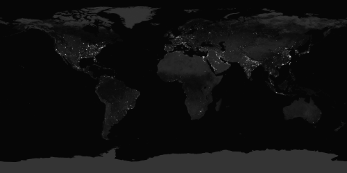
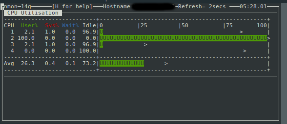
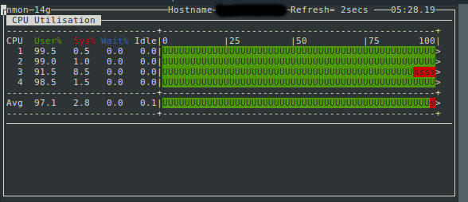
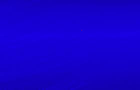
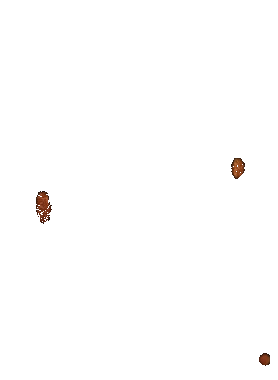

<!-- TOC depthFrom:1 depthTo:6 withLinks:1 updateOnSave:0 orderedList:0 -->

- [Document for question1](#document-for-question1)
	- [Code explanation](#code-explanation)
		- [imread(String FILE_PATH, int FLAG)](#imreadstring-file_path-int-flag)
		- [Calculating elapsed time](#calculating-elapsed-time)
		- [GaussianBlur implement](#gaussianblur-implement)
	- [Output explanation](#output-explanation)
		- [Test0](#test0)
		- [Test1](#test1)
- [Document for part2](#document-for-part2)
	- [Code explanation](#code-explanation-1)
	- [Output explanation](#output-explanation-1)
		- [Test0](#test0-1)
		- [Test1](#test1-1)

<!-- /TOC -->
# Document for question1

first questions purpose is to add Gaussian blur filter to an image in two sequential and parallel method and compare their speeds.
parallel method implementation should use the `tbb` library.


## Code explanation
### imread(String FILE_PATH, int FLAG)
`cv::imread` function converts each image into `cv::Mat`<br>
`cv::Mat` object acts like 2d or 3d matrix

>FLAG -->
- **\>0:** Return a 3-channel color image.
- **=0:** Return a grayscale image.
- **<0:** Return the loaded image as is (with alpha channel).

### Calculating elapsed time:
To calculate elapsed time `std::clock` function can be used.<br>
by using this code block:
```
#include <ctime>
clock_t begin=clock(); //start counting
/* some
  codes
  that
  takes
  time */
std::cout<<"elapsed time: "<<double(clock()-begin)/CLOCKS_PER_SEC<<"\n";
```
Same method is also used to calculate the elapsed time for parallel/sequential.

### GaussianBlur implement

To add gaussian blur filter we split the whole image into `kernel_size`x`kernel_size` images(using `cv::Mat(Range(),Range())` function).<br>
Since `tbb::parallel_for` does not support ***step*** in for, max value can multiply by ***step***

>this two blockes are same:

```
for(int i=min;i<max;i+=step){
  //some_code
}

tbb::parallel_for(0,(max-min)/step,[&](int _i){
  int i=min+_i*step;
  //some_code
});
```

as [parallel_for doc](https://www.threadingbuildingblocks.org/docs/help/index.htm#tbb_userguide/parallel_for.html) mentioned, using nested *for* can reduce the speed due to chunking methods ,So we can use one *loop* instead:
```
tbb::parallel_for(0, src.rows/kernel_size, [&](int i_){
  tbb::parallel_for(0, src.cols/kernel_size, [&](int j_){
        int i=i_*kernel_size,j=j_*kernel_size;
        int width =min(i+kernel_size,src.rows);
        int height=min(j+kernel_size,src.cols);
        Mat tile=dst1(Range(i,width),Range(j,height));
        GaussianBlur(tile,tile,Size(kernel_size,kernel_size),0,0);});});
```
can be rewritten as:
```
tbb::parallel_for(0,src.rows*src.cols/kernel_size/kernel_size, [&](int k){
   int i=k%(src.rows/kernel_size);int j=k/(src.rows/kernel_size);
   int width =min(i+kernel_size,src.rows);
   int height=min(j+kernel_size,src.cols);
   Mat tile=dst1(Range(i,width),Range(j,height));
   GaussianBlur(tile,tile,Size(kernel_size,kernel_size),0,0);});
```

## Output explanation

### Test0

The purpose of this question is to add Gaussian blur filter to an image in two sequential and parallel method and compare their speeds.

input file size: 225x291 pixels
input image is converted to matrix in Line14 and the output image is the same size as the input image with guassian blur filter.as shown below:

***input:***  <br><br>
***output:*** 
<br><br>
the printed output in terminal is shown here:
```
 elapsed time for sequential method: 0.01602
 elapsed time for parallel method: 0.026777
```
One of the questions purpose is to compare the methods speed.To compare execution speeds we can compare the time(seconds) that is used by each method.In this test sequential execution time is 0.01602 seconds and parallel method execution time is 0.026777 seconds.

 >as you see the parallel method takes as twice the sequential method. The reason is making threads and combining them takes much more time from CPUs.


>IDEA: if the image gets bigger the used time by each thread gets longer, So it makes the calculation more efficient

to test this idea we can run the program using bigger images
**lets use bigger image** <br>

### Test1

The purpose of this question is to add Gaussian blur filter to an image in two sequential and parallel method and compare their speeds.

input file size: 13500x6750 pixels
input image is converted to matrix in Line14 and the output image is the same size as the input image with guassian blur filter.as shown below:

**input:**
<br><br>
***output:*** 
<br><br>
the printed output in terminal is shown here:
```
elapsed time for sequential method: 18.9306
elapsed time for parallel method: 32.5529
```
One of the questions purpose is to compare the methods speed.
to compare execution speeds we can compare the time(seconds) that is used by each method.
In this test sequential execution time is 18.9306 seconds and parallel method execution time is 32.5529 seconds.

>the ratio of **parallel-method-time** over **sequential-method-time** is decreased to less than 2, which means parallel methods can overcome the sequential methods in big number of calculations

### CPU usages

To prove that the code is running in two methods we can monitor cpu usages while the code is running

There is several ways to monitor CPU usage.
In linux we can use `nmon` programe which provides several tools to monitor system resorces.

the screen shots of `nmon` output is shown below:

**while running sequential method:**<br><br>
 **while running parallel method:**<br>

 #NOTE:images provided using `nmon`

 >as you can see in those pictures all CPU cores are used up.<br>

**running system cinfiguration:**
 - CPU: Intel(R) Core(TM) i7-6500U CPU @ 2.50GHz

<div class="page-break"></div>

# Document for part2
 This section's final purpose is to find the differences between two images.

## Code explanation
 In order to find the differences:

- first absolute difference value of each corresponding pixels in two pictures must be calculated:<br>
```
Q[i,j][RED]=|P0[i,j][RED]-P1[i,j][RED]|
Q[i,j][GREEN]=|P0[i,j][GREEN]-P1[i,j][GREEN]|
Q[i,j][BLUE]=|P0[i,j][BLUE]-P1[i,j][BLUE]|
```
- for each pixel apply binary threshold:<Br>
```
#define Threshold 10
if(Q[i,j][RED]<Threshold && Q[i,j][GREEN]<Threshold && Q[i,j][BLUE]<Threshold)
  Q[i,j]=WHITE_PIXEL
```
The accuracy depends on threshold value

## Output explanation

caution: in order to find differences, two images must be approximately the same.

### Test0:

This section's final purpose is to find the differences between two images.
In this test case we use two blue images which one of them has a single red pixel in a random location and the programe is going to find that red pixel's location.
<br><br>
***input0:***
<br><br>
***input1:***


>if you look exactly you can see there is a single red pixel in second image

As mentioned before all same pixels are colored white, because the threshold convert each pixel that is approximately same into white.

***output:***

the printed output in terminal is shown here:
```
- (60,165)
white pixel percentage is:99.998
```
those lines wich starts by hyphen are the location of the pixels which are not same,and the last line of the output shows the percentage of white pixels.

So red pixel is in `(60,165)`

### Test1:
This section's final purpose is to find the differences between two images.
In second test we will use two images with more different colors.
second image is a copy of the first image wich is colored in black in several spots
<br><br>
*Input*<br>

<br><br><br>
*Output*<br>

two input images have three differences and output obviously shows this differences and their locations.

the printed output in terminal is shown here:
```
- (195,291)
- (195,292)
- (195,293)
- (196,290)
- (196,291)
- (196,292)
- (196,293)
- (196,294)
- (196,295)
    .
    .
    .
- (451,326)
- (451,327)
- (451,328)
- (451,329)
- (451,330)
- (451,331)
- (451,332)
- (452,328)
white pixel percentage is:99.3741
```
those lines wich starts by hyphen are the location of the pixels which are not same,and the last line of the output shows the percentage of white pixels.
